<p align="center">
  
  
  
  
</p>

<h1 align="center">AgentForge</h1>
<h3 align="center">A Local Multi-Agent AI Software Development Environment</h3>

---

## Abstract

AgentForge is a browser-based multi-agent AI system designed to simulate a real software development organization. Instead of relying on a single AI model to complete tasks, AgentForge coordinates multiple specialized AI agents that collaboratively **design**, **develop**, **test**, and **document** software projects.

The system runs entirely on a local machine and uses lightweight local language models (≤7 GB) to enable private, offline AI orchestration.

AgentForge introduces a visual and interactive interface where each AI agent behaves like a team member in a digital workspace. Users can observe real-time collaboration between agents such as a **Project Manager**, **Frontend Developer**, **Backend Engineer**, **DevOps Specialist**, **QA Tester**, and **Documentation Writer**.

This system demonstrates how multi-agent architectures can emulate real-world engineering workflows while remaining accessible on consumer hardware.

---

## Vision

Traditional AI systems operate as a single agent responding to prompts. Complex tasks such as software development naturally require collaboration between multiple specialized roles.

AgentForge explores a new paradigm where AI systems replicate the structure of real engineering teams.

**Traditional approach:**

```
User  ──►  Single AI  ──►  Output
```

**AgentForge approach:**

```
User  ──►  Project Manager Agent  ──►  Distributed Agent Tasks  ──►  Integrated Output
```

This approach enables:

| Capability | Description |
|---|---|
| **Modular Intelligence** | Each agent owns a well-defined domain of expertise |
| **Specialized Problem Solving** | Agents apply domain-specific reasoning to their tasks |
| **Parallel Task Execution** | Independent tasks run concurrently across agents |
| **Traceable Workflows** | Every decision, output, and handoff is logged and visible |

---

## Core Concept

AgentForge functions as a **local AI development company** operating inside the browser.

The user provides a prompt such as:

> *"Build a full-stack portfolio website with authentication."*

The system then orchestrates a team of AI agents that collaborate to produce the result. Each agent has:

- a defined **role**
- a specific **task domain**
- **communication** with other agents
- **visible progress** in the UI

The user can observe this collaboration in real time.

---

## System Overview

AgentForge consists of five primary subsystems:

| # | Subsystem | Purpose |
|---|---|---|
| 1 | **User Interface Layer** | Browser dashboard for prompt input, monitoring, and output review |
| 2 | **Agent Orchestration Layer** | Central engine that decomposes tasks, assigns work, and manages dependencies |
| 3 | **AI Execution Layer** | Local LLM runtime powering each agent's reasoning |
| 4 | **Communication Layer** | Real-time event streaming between backend and browser |
| 5 | **Storage Layer** | Persistent storage for project files, logs, and agent memory |

---

### High-Level Architecture

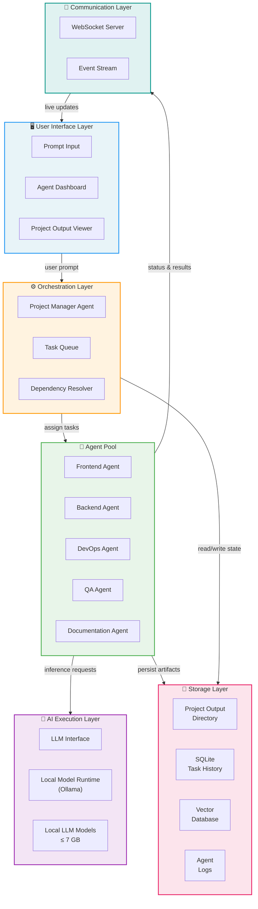

---

## Agent Architecture

Each AI agent in the system represents a specialized role in a software development team. Agents operate independently but communicate through a centralized orchestrator. They receive tasks, generate outputs, and report their status back to the orchestrator.

### Agent Interaction Model

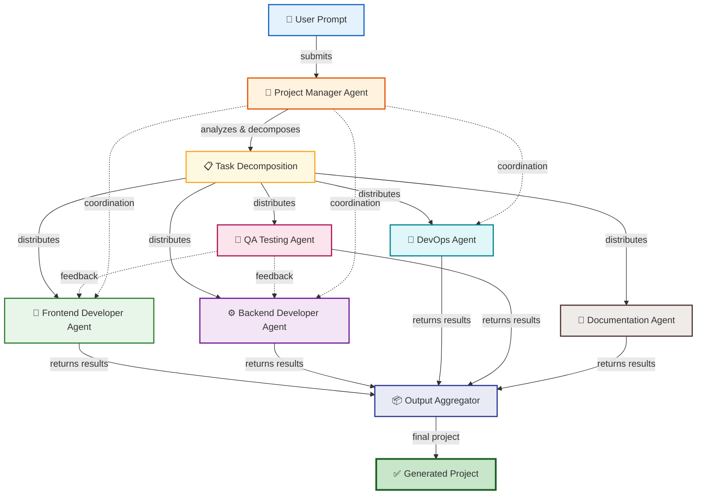

---

## Agent Roles

### Project Manager Agent

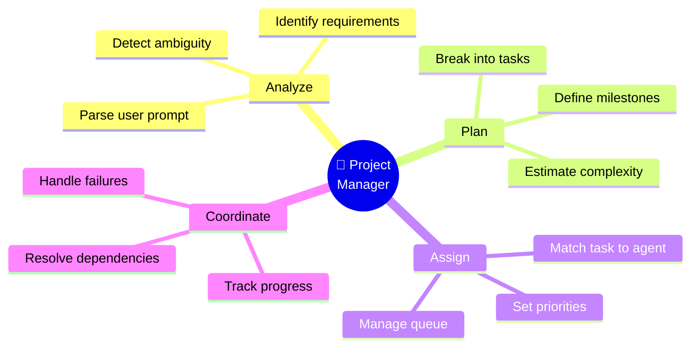

The Project Manager agent acts as the **central planning intelligence**. It is the first agent to receive the user prompt and the last to sign off on the final output.

---

### Frontend Developer Agent

| Area | Details |
|---|---|
| **Domain** | UI/UX implementation |
| **Frameworks** | React, Vue, Svelte, HTML/CSS |
| **Outputs** | Components, layouts, styling, client-side logic |
| **Receives from** | Project Manager (task specs), Backend Agent (API contracts) |
| **Sends to** | QA Agent (UI artifacts), Output Aggregator |

---

### Backend Developer Agent

| Area | Details |
|---|---|
| **Domain** | Server-side logic and data |
| **Frameworks** | Node.js, Python/Flask, Express |
| **Outputs** | API routes, database schemas, authentication, business logic |
| **Receives from** | Project Manager (task specs) |
| **Sends to** | Frontend Agent (API contracts), QA Agent, Output Aggregator |

---

### DevOps Agent

| Area | Details |
|---|---|
| **Domain** | Infrastructure and environment |
| **Tools** | Docker, shell scripts, config files |
| **Outputs** | Dockerfiles, env configs, deployment scripts, project scaffolding |
| **Receives from** | Project Manager, Backend Agent |
| **Sends to** | Output Aggregator |

---

### QA Testing Agent

| Area | Details |
|---|---|
| **Domain** | Quality assurance and validation |
| **Capabilities** | Static analysis, integration checks, output verification |
| **Outputs** | Test reports, error logs, fix suggestions |
| **Receives from** | Frontend Agent, Backend Agent |
| **Sends to** | Project Manager (issues), Output Aggregator |

---

### Documentation Agent

| Area | Details |
|---|---|
| **Domain** | Technical writing |
| **Outputs** | README files, architecture docs, setup guides, usage instructions |
| **Receives from** | All other agents (context and artifacts) |
| **Sends to** | Output Aggregator |

---

## Agent Workflow

AgentForge operates using a structured development pipeline with well-defined stages.

### Task Execution Flow

```mermaid
flowchart LR
    A["👤 User\nPrompt"] --> B["🎯 Project\nManager"]
    B --> C["📋 Task\nDecomposition"]
    C --> D["📬 Task\nQueue"]

    D --> E["🔀 Parallel Agent Execution"]

    subgraph E["🔀 Parallel Agent Execution"]
        direction TB
        FE["🎨 Frontend"]
        BE["⚙️ Backend"]
        DV["🐳 DevOps"]
        QA["🧪 QA"]
        DC["📝 Docs"]
    end

    E --> F["📦 Output\nAggregation"]
    F --> G["✅ Generated\nProject Files"]

    style A fill:#E3F2FD,stroke:#1565C0
    style B fill:#FFF3E0,stroke:#E65100
    style C fill:#FFF8E1,stroke:#F9A825
    style D fill:#F1F8E9,stroke:#558B2F
    style F fill:#E8EAF6,stroke:#283593
    style G fill:#C8E6C9,stroke:#1B5E20,stroke-width:3px
```

### Detailed Execution Sequence

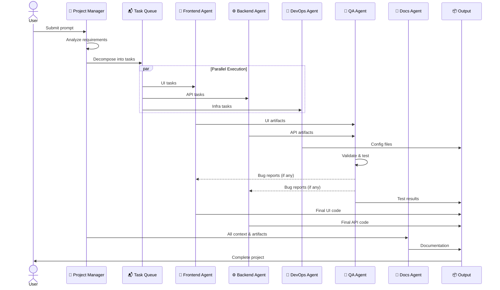

---

## Visual Workspace Concept

AgentForge includes a visual dashboard that simulates a digital software company workspace. Each agent appears as a card or workspace module.

### Workspace Dashboard Layout

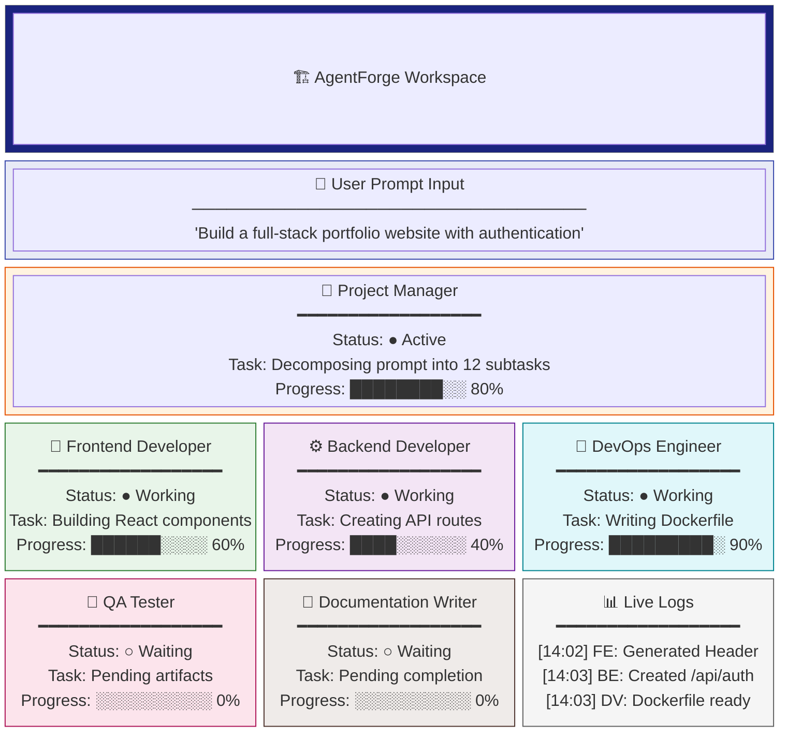

Each tile contains:

- **Status indicator** — active, waiting, completed, or error
- **Task description** — current assignment from the orchestrator
- **Progress bar** — visual completion metric
- **Logs** — real-time output stream from the agent

---

## Local AI Execution

AgentForge runs AI models locally using lightweight LLMs. This ensures:

- **Privacy** — no data leaves the machine
- **Offline operation** — zero internet dependency
- **No API costs** — no external service billing
- **Full user control** — model selection and configuration

### Local Model Architecture

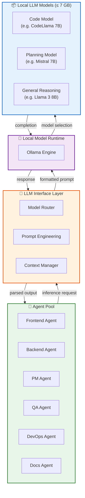

### Model Selection Strategy

| Agent | Recommended Model Type | Reasoning |
|---|---|---|
| Project Manager | Planning / Reasoning | Needs strong decomposition and planning capabilities |
| Frontend Agent | Code Generation | Optimized for HTML, CSS, JavaScript, React |
| Backend Agent | Code Generation | Optimized for Python, Node.js, SQL |
| DevOps Agent | Code Generation | Docker, YAML, shell scripting |
| QA Agent | General Reasoning | Analysis, comparison, error detection |
| Documentation Agent | General Reasoning | Natural language generation, technical writing |

---

## Real-Time Communication System

The system includes real-time updates between backend processes and the browser interface.

### Communication Flow

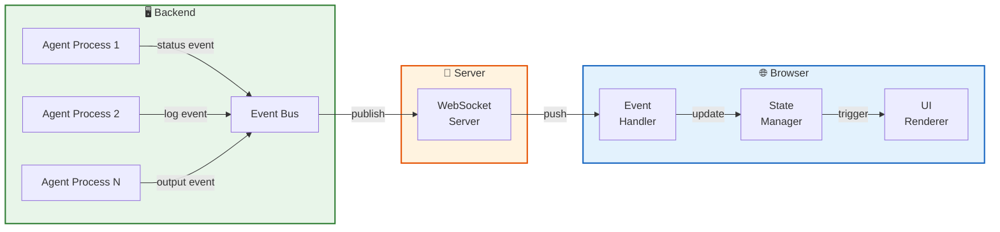

### Event Types

| Event | Source | Payload |
|---|---|---|
| `agent.started` | Orchestrator | `{ agentId, taskId, timestamp }` |
| `agent.progress` | Agent | `{ agentId, percentage, message }` |
| `agent.log` | Agent | `{ agentId, level, content }` |
| `agent.output` | Agent | `{ agentId, files[], artifacts[] }` |
| `agent.completed` | Agent | `{ agentId, taskId, duration }` |
| `agent.error` | Agent | `{ agentId, error, stackTrace }` |
| `project.completed` | Orchestrator | `{ projectId, outputPath }` |

---

## Browser Notification System

AgentForge includes a local browser notification system. Users receive alerts when key events occur.

### Notification Flow

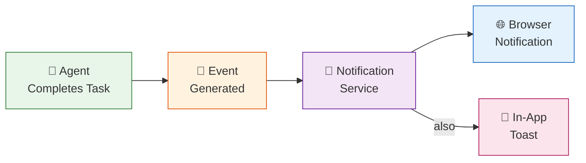

**Notification triggers:**

- ✅ Task started
- ✅ Task completed
- ✅ Project finished
- ❌ Error detected
- ⚠️ Agent waiting on dependency

---

## Storage System

The system stores generated artifacts locally across three storage tiers.

### Storage Architecture

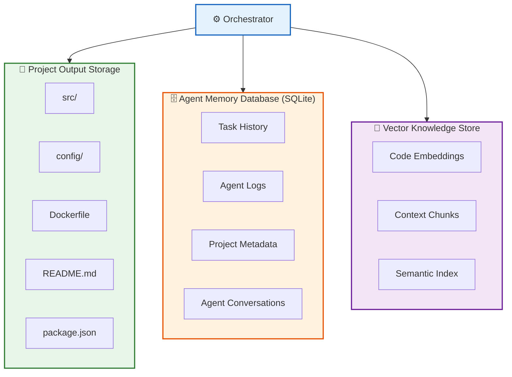

| Storage Tier | Technology | Purpose |
|---|---|---|
| Project Output | Local filesystem | Generated source code, configs, and assets |
| Agent Memory | SQLite | Task history, logs, metadata, agent state |
| Vector Store | Google ScaNN | Semantic search over code and context |

---

## Example Execution Scenario

**User prompt:**

> *"Create a full-stack portfolio website with authentication."*

### Execution Timeline

```mermaid
gantt
    title AgentForge Execution Timeline
    dateFormat X
    axisFormat %s

    section Project Manager
        Analyze prompt           :done, pm1, 0, 5
        Decompose into tasks     :done, pm2, 5, 12
        Distribute to agents     :done, pm3, 12, 15

    section Frontend Agent
        Scaffold React project   :active, fe1, 15, 25
        Build components         :fe2, 25, 45
        Implement styling        :fe3, 45, 55

    section Backend Agent
        Setup Express server     :active, be1, 15, 22
        Create API routes        :be2, 22, 35
        Implement auth           :be3, 35, 50

    section DevOps Agent
        Generate Dockerfile      :active, dv1, 15, 22
        Write env config         :dv2, 22, 28

    section QA Agent
        Validate frontend        :qa1, 55, 65
        Validate backend         :qa2, 50, 62
        Integration check        :qa3, 65, 72

    section Documentation Agent
        Generate README          :dc1, 72, 80
        Write setup guide        :dc2, 80, 85

    section Output
        Aggregate & deliver      :crit, out1, 85, 90
```

### Step-by-Step Breakdown

| Step | Agent | Action | Output |
|---|---|---|---|
| 1 | Project Manager | Analyze prompt, identify requirements | Task list with 12 subtasks |
| 2 | Project Manager | Distribute tasks to specialized agents | Task assignments |
| 3 | Frontend Agent | Scaffold React project, build components | `src/components/`, `App.jsx`, CSS |
| 4 | Backend Agent | Create Express server, API routes, auth | `server.js`, `routes/`, `models/` |
| 5 | DevOps Agent | Generate Dockerfile, env config | `Dockerfile`, `.env.example` |
| 6 | QA Agent | Validate outputs, check integration | Test report, error log |
| 7 | Documentation Agent | Generate README, setup guide | `README.md`, `SETUP.md` |
| 8 | Orchestrator | Aggregate all outputs | Complete project directory |

---

## Design Principles

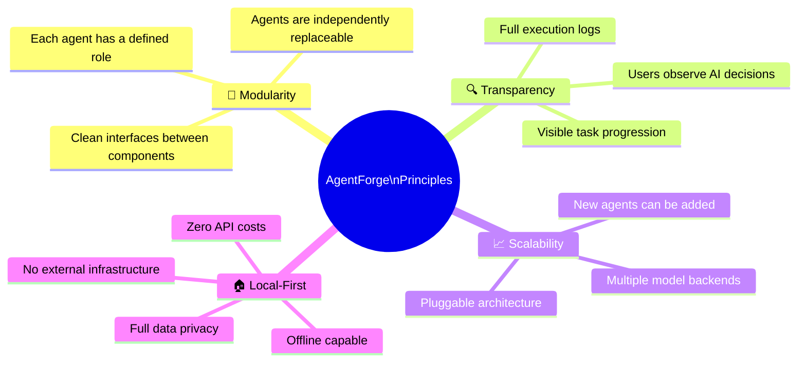

---

## Technology Stack

| Layer | Technology | Purpose |
|---|---|---|
| Frontend | React + TypeScript | Dashboard UI |
| Backend | Node.js / Python (FastAPI) | Orchestration and API server |
| Real-Time | WebSocket (Socket.IO) | Live agent status updates |
| LLM Runtime | Ollama | Local model inference |
| Database | SQLite | Task and agent state persistence |
| Vector Store | Google ScaNN | Semantic context retrieval |
| Containerization | Docker | Reproducible runtime environment |

---

## Future Extensions

| Extension | Description |
|---|---|
| 🔐 Security Analysis Agent | Automated vulnerability scanning and penetration testing |
| 🐛 Bug-Fixing Agent | Autonomous detection and repair of code issues |
| 🔄 Multi-Model Collaboration | Different LLMs specialized per agent role |
| 🧩 Plugin Ecosystem | Community-contributed agent types and workflows |
| 🌐 Distributed Agent Networks | Agents running across multiple machines |
| 📊 Analytics Dashboard | Historical performance metrics and optimization insights |

---

## Conclusion

AgentForge demonstrates how collaborative AI agents can replicate the structure and workflow of real software engineering teams. By combining:

- **Multi-agent orchestration** for parallel, specialized task execution
- **Local AI models** for privacy and accessibility
- **Interactive visualization** for transparency and observability

AgentForge provides a new framework for autonomous development systems that highlights the potential of decentralized AI collaboration while remaining accessible on consumer-grade hardware.

---

<p align="center"><em>AgentForge — Where AI agents build software together.</em></p>
